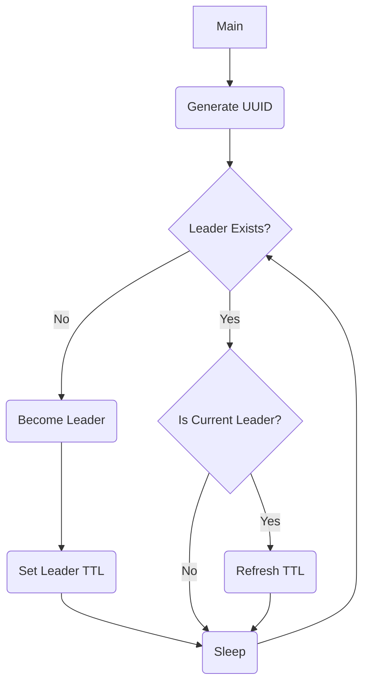
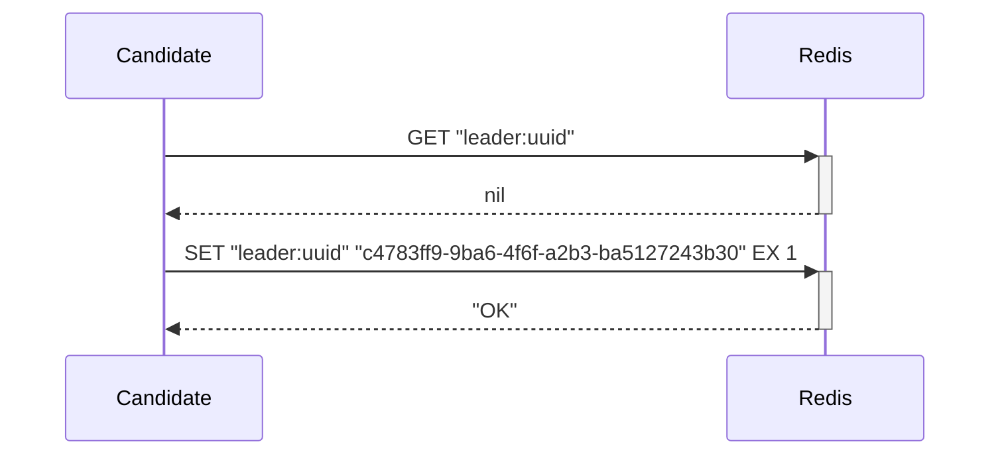
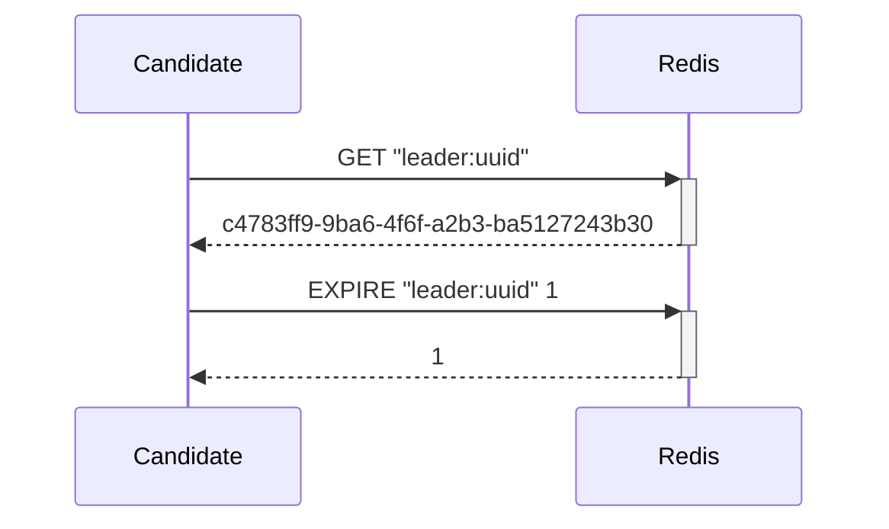
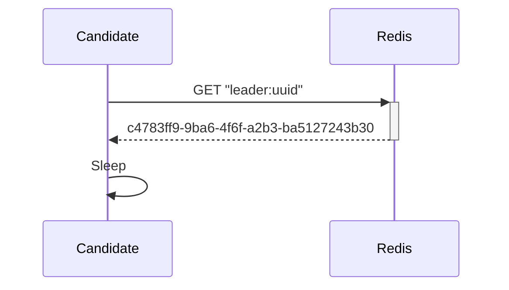

# scheduler

## What Is This?

I wrote this to be one example of how to SRE.  It is a distributed leader system implemented in Go.  It contains some observability signals, but not all.  It doesn't actually _do_ anything -- it just allows multiple instances of an application to lazily obtain leadership.

> In this case, `lazily` means "oh, no one else is the leader?  guess I'll become the leader..."  This is in contrast to opportunistic, in which a candidate might attempt to become the leader without checking first.

In this example system, the Redis implmentation is intended to be pluggable with some other implementation.  However, since only the Redis implementation exists, there may be name clashes, inconsistencies, or expectations that cannot be satisfied with other implementations.

### Prerequisites

You need a running Redis instance.  While this is written to be modular, the only supported implementation currently requires Redis.

### Running

Docker:

```
docker buildx build -t scheduler -f Containerfile .
docker run \
    -it \
    --rm \
    -e APP_ENV="development" \
    -e METRICS_PORT="9834" \
    -e REDIS_HOST=127.0.0.1 \
    -e REDIS_PORT=6379 \
    -e REDIS_PASSWORD="example" \
    -e REDIS_LEADER_KEY="leader:uuid" \
    scheduler
```

Locally:

```bash
APP_ENV="development" \
    METRICS_PORT="9834" \
    REDIS_HOST=127.0.0.1 \
    REDIS_PORT=6379 \
    REDIS_PASSWORD="example" \
    REDIS_LEADER_KEY="leader:uuid" \
    go run cmd/scheduler/main.go
```

Run the above in multiple terminal windows.  Change `METRICS_PORT` to a different port each time.  You can `curl 127.0.0.1:$METRICS_PORT/metrics` for each instance to see its Prometheus metrics.  Randomly kill instances and observe log messages on other instances.  You can also check the metrics.

> A Helm chart is provided but is outside of the scope of this README (for now).

### Configuration

Environment Variables:
* `APP_ENV`: Set to `development` for debug logs.
* `METRICS_PORT`: The port on which the Prometheus metrics will listen
* `REDIS_HOST`: IP or FQDN of the Redis host used for storing the leader key
* `REDIS_PORT`: Port on which the `REDIS_HOST` is listening
* `REDIS_PASSWORD`: Password used for authenticating to Redis
* `REDIS_LEADER_KEY`: The key that will be used for determining the current leader/writing a new leader

## Design

### High Level

The diagram below shows the approximate logic of leader election.



Outside of this logic, a subsystem implements a Leader TTL.  This may be implemented by code directly or by an external system, such as Redis's expiration/TTL.  In either case, expiring the current Leader is a failsafe for the system and should not be the reponsibility of the Leader or any Candidate Leaders.


### Reference Sequence diagrams

The diagrams below shows the reference Redis implmenetation sequence diagram.

#### No Current Leader



#### Current Leader



#### Not Current Leader



### Leaders and Candidate Leaders

When multiple systems start simultaneously, every system is a Candidate Leader.  Each Candidate Leader must implement the following:

* `ReadLeader()`:  Determines the current leader
* `IsCurrentLeader()`: Determines if the current Candidate Leader is the Active Leader
* `WriteLeader()`: Claims itself as the Active Leader if no other system has claimed itself as Active Leader

### Failure Scenarios

In this system, race conditions may exist that result in multiple Candidate Leaders thinking that they are the Active Leader during the first few seconds of system initialization.  However, the system should converge within a few seconds.  Once converged, failover may occur for any of the following reasons:

* Network partition
* CPU throttling of the Active Leader
* OOMKilling of the Active Leader
* Network delay exceeding tolerance of the Active Leader
* Failure of the external data repository tracking the Active Leader

In this system, election is opportunistic.  Quorum is not formed, and Candidate Leaders do not know about each other.  Candidate Leaders will typically rely on an external data repository, and depending on that repository, split brain scenarios may occur.  In some circumstances, such as when no Candidate Leader can write to the external data repository, the system may have no Active Leader, and the system may enter a stalemate, resulting in 100% loss of data until the external data repository can receive writes from an Active Leader again.

The tradeoffs may seem extreme, but they ultimately result in a very simple system.  The ways in which it can fail are well understood, and the risks are known in advance.  We can, therefore, build compensating controls.  We can also choose an implementation like this based on our SLOs and acceptance of risk.

### Monitoring

#### Metrics

* `scheduler_leader_claimed_total`: Total number of times this candidate has claimed leadership
* `scheduler_leader_refreshed_total`: Total number of times this leader has refreshed leadership
* `scheduler_leader_read_total`: Total number of times this candidate or leader has checked leadership
* `scheduler_leader_current_leader`: 1 if this is the leader; 0 if not

#### Logs

* Error
  * `Unable to create leader`: Unable to generate UUID.  Additional details in the message.
  * `Error writing leader`: Unable to write current leader to external store.  Additional details in the message.
  * `Unable to start HTTP Server`: Unable to start the Prometheus HTTP metrics server.  Additional details in the message.Additional details in the message.
* Info
  * `Created new leader`: Successfully created a new leader.  Additional details will contain the UUID and leader key.
  * `Becoming the leader`: Current Candidate Leader is taking over as the Active Leader.  Additional details will contain the UUID and leader key.
* Debug
  * `Writing leader`: Trying to write leader
  * `Ending Goroutine.`: Received SIGTERM.  Ending leader Goroutine.
  * `Closing gracefully.`: Received SIGTERM.  Completing cleanup.
  * `Creating leader`: Creating a new leader soon.  Additional details will container the Redis host, port, password, and leader key.
  * `Refreshing leader lock`: Active leader is renewing its lock.  Additional details will contain the UUID and leader key.
